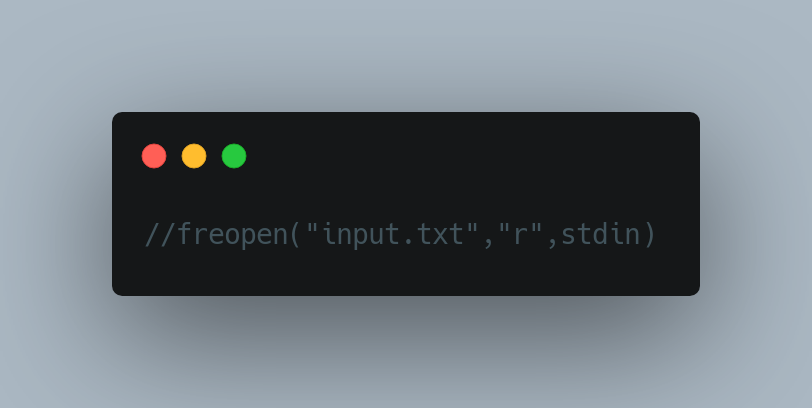

# Matrix solver


## Description
The program solves a system of linear equation in a Matrix

## Requirments

- A gcc compiler

## Installation

To install a gcc compiler go to [how to install](https://gcc.gnu.org/install/)

## Usage

To compile:
```bash
g++ -o myprogram main.cpp
```

To run:

```bash
./myprogram
```

If you want the input from the **input.txt** file.
- Go to main.cpp and uncomment the following code:

